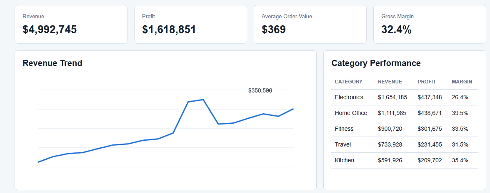
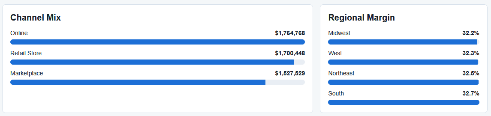
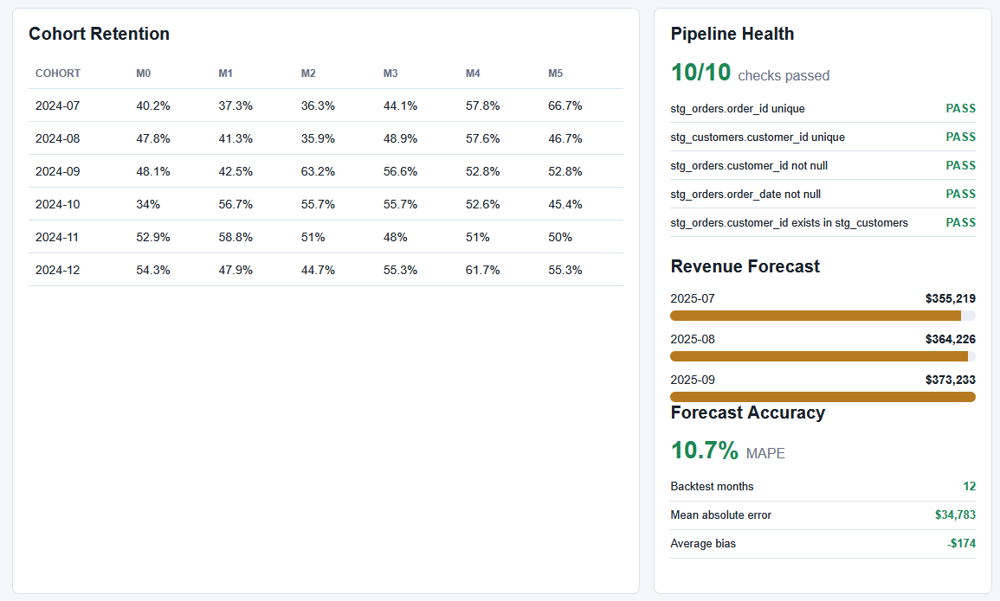
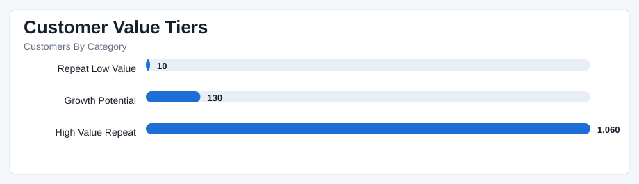
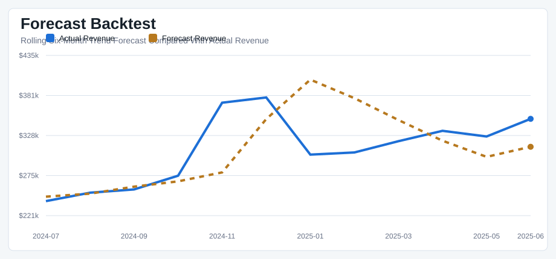
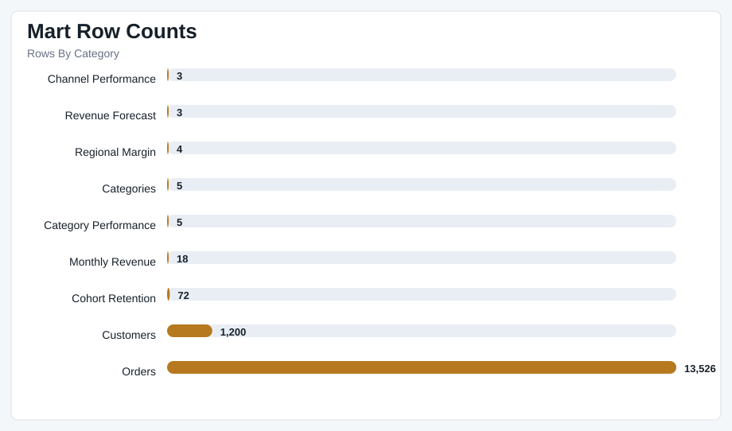
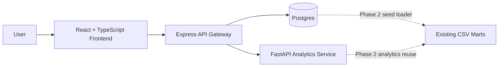

# Retail Growth Analytics

[](https://github.com/efazHossain/retail-growth-analytics/actions/workflows/ci.yml)

Retail Growth Analytics is an ongoing personal data analytics and analytics engineering project. It simulates how raw retail transaction data moves through a trusted analytics workflow: generated source files, staging models, facts and dimensions, business marts, data quality checks, SQL-style analysis outputs, Python analysis, dashboard reporting, and written findings.

The project is built to answer a practical business question: how can a retail business grow revenue while protecting margin?

## Dashboard Preview

### Overview



### Performance Views



### Advanced Analytics



## Python Analysis Preview

### Customer Value Tiers



### Forecast Backtest



### Mart Profiling



## What This Project Shows

- Analytics engineering: raw, staging, dimensional, mart, quality, and monitoring layers
- Data analytics: revenue trends, profitability, discounting, regional performance, and customer behavior
- Forecasting discipline: directional revenue forecasts plus rolling backtests with MAE, MAPE, and bias
- Monitoring: rolling anomaly alerts for revenue, margin, discounting, and fulfillment days
- Communication: findings, metric definitions, model catalog, lineage, BI handoff notes, screenshots, and project summary

## Project Structure

```text
data/
  raw/              Generated source CSVs
  staging/          Cleaned source-aligned models
  marts/            Facts, dimensions, and analysis-ready marts
  quality/          Validation check outputs
  analysis_outputs/ Reproducible SQL-style analysis extracts
  warehouse/        CSV warehouse manifest for BI/database loading
  run_history/      Pipeline run history and latest run summary
  processed/        Dashboard summary outputs and executive summary
dashboard/          Local dashboard
python/             Optional Python profiling, segmentation, and forecast scripts
scripts/            Data generation and analysis pipeline
sql/                SQL business questions and analysis queries
docs/               Documentation, findings, screenshots, lineage, and handoff notes
dbt/                dbt-style model and test scaffold for future conversion
```

## Quick Start

```powershell
node scripts/build.js
node dashboard/server.js
```

Then open `http://localhost:4173`.

## Full-Stack Architecture Roadmap

This repository is being extended into a cloud-ready Retail Intelligence Platform while keeping the existing analytics pipeline intact. Phase 1 adds a minimal full-stack scaffold without replacing the current CSV marts or static dashboard.



Phase 1 services:

- `apps/frontend`: React, TypeScript, and Material UI app shell
- `apps/api`: Express API gateway with health, dashboard, and analytics routes
- `services/analytics`: FastAPI service with health and placeholder business summary route
- `infra/postgres`: local Postgres schema and mart seed loader

To start the full-stack scaffold locally:

```powershell
docker compose up --build
```

Then open:

- Frontend: `http://localhost:5173`
- API health: `http://localhost:3000/health`
- Dashboard summary: `http://localhost:3000/api/dashboard/summary`
- Analytics proxy/placeholder: `http://localhost:3000/api/analytics/health`
- Analytics service health: `http://localhost:8000/health`
- Analytics business summary: `http://localhost:8000/analytics/business-summary`

More details are in [Full-stack architecture roadmap](docs/full-stack-architecture.md).

### Phase 2 Data Serving Layer

Phase 2 adds a Postgres-backed API over the existing mart CSVs. The CSV pipeline still owns data generation and mart creation; Postgres is the local serving layer for the Express API.

Start the database, load the marts, and run the API:

```powershell
docker compose up -d postgres
docker compose --profile seed run --rm seed
docker compose up -d --build api
```

Available dashboard data endpoints:

- `GET /api/dashboard/summary`
- `GET /api/dashboard/revenue?limit=6`
- `GET /api/dashboard/categories?limit=5`
- `GET /api/dashboard/regions?region=Midwest`
- `GET /api/dashboard/channels?channel=Online`
- `GET /api/dashboard/cohorts?month=2024-01`
- `GET /api/dashboard/forecast?limit=6`
- `GET /api/dashboard/anomalies?limit=10`

PowerShell smoke checks:

```powershell
Invoke-RestMethod http://localhost:3000/health
Invoke-RestMethod http://localhost:3000/api/dashboard/summary
Invoke-RestMethod "http://localhost:3000/api/dashboard/revenue?limit=6"
Invoke-RestMethod "http://localhost:3000/api/dashboard/forecast?limit=6"
```

See [Data serving layer](docs/data-serving-layer.md) for schema and seed details.

### Phase 3 Executive Dashboard

The React frontend now includes a Postgres-backed executive dashboard that calls the Phase 2 API endpoints. Recharts is used for lightweight React charts because the scaffold did not previously include a charting library.

Run the full local stack:

```powershell
docker compose up -d postgres
docker compose --profile seed run --rm seed
docker compose up -d --build api frontend
```

Then open `http://localhost:5173`.

Frontend environment:

- `VITE_API_BASE_URL`: base URL for the Node API; defaults to `http://localhost:3000`

The executive dashboard consumes:

- `GET /api/dashboard/summary`
- `GET /api/dashboard/revenue`
- `GET /api/dashboard/categories`
- `GET /api/dashboard/regions`
- `GET /api/dashboard/channels`
- `GET /api/dashboard/cohorts`
- `GET /api/dashboard/forecast`
- `GET /api/dashboard/anomalies`

### Phase 4 Analyst Workspace

The React frontend now includes an Analyst Workspace for interactive mart exploration. It reuses the Phase 2 API and applies filters to compatible endpoints:

- `month`: revenue, cohort, forecast, and anomaly views
- `category`: category performance
- `region`: regional margin
- `channel`: channel performance
- `limit`: row counts for API-backed tables and charts

Run the same local stack and open the Analyst tab:

```powershell
docker compose up -d postgres
docker compose --profile seed run --rm seed
docker compose up -d --build api frontend
```

API query examples:

```powershell
Invoke-RestMethod "http://localhost:3000/api/dashboard/revenue?month=2025-06"
Invoke-RestMethod "http://localhost:3000/api/dashboard/categories?category=Electronics"
Invoke-RestMethod "http://localhost:3000/api/dashboard/regions?region=Midwest"
Invoke-RestMethod "http://localhost:3000/api/dashboard/channels?channel=Online"
Invoke-RestMethod "http://localhost:3000/api/dashboard/forecast?month=2025-06"
Invoke-RestMethod "http://localhost:3000/api/dashboard/anomalies?month=2025-06"
```

The full build runs:

```text
generate raw data
build staging models
build marts
validate data quality
run SQL-style analysis outputs
write dashboard summary
record run history
```

## Optional Python Layer

If you want to run the optional Python analysis layer:

```powershell
py -m venv .venv
.\.venv\Scripts\Activate.ps1
python -m pip install -e .
python python/run_all.py
```

Python outputs are written to `python/outputs/`.

## Core Outputs

- `data/marts/fact_orders.csv`
- `data/marts/dim_customers.csv`
- `data/marts/dim_categories.csv`
- `data/marts/mart_monthly_revenue.csv`
- `data/marts/mart_channel_performance.csv`
- `data/marts/mart_regional_margin.csv`
- `data/marts/mart_category_performance.csv`
- `data/marts/mart_cohort_retention.csv`
- `data/marts/mart_revenue_forecast.csv`
- `data/marts/mart_forecast_backtest.csv`
- `data/marts/mart_forecast_accuracy.csv`
- `data/marts/mart_anomaly_alerts.csv`
- `data/analysis_outputs/`
- `data/run_history/pipeline_runs.csv`
- `data/processed/summary.json`

## Documentation

- [Project summary](docs/project-summary.md)
- [Data model](docs/data-model.md)
- [Model catalog](docs/model-catalog.md)
- [Data dictionary](docs/data-dictionary.md)
- [Lineage](docs/lineage.md)
- [Metrics definition](docs/metrics-definition.md)
- [Data quality](docs/data-quality.md)
- [Anomaly detection](docs/anomaly-detection.md)
- [Orchestration](docs/orchestration.md)
- [Analytics questions](docs/analytics-questions.md)
- [Findings](docs/findings.md)
- [BI handoff](docs/bi-handoff.md)
- [Dashboard screenshots](docs/dashboard-screenshots.md)
- [Python workflow](docs/python-workflow.md)
- [Python analysis report](docs/python-analysis-report.md)
- [Project log](docs/project-log.md)

## Dashboard

The local dashboard includes:

- KPI cards for revenue, profit, average order value, and gross margin
- monthly revenue trend
- category performance
- channel mix
- regional margin
- cohort retention
- pipeline health
- revenue forecast
- forecast accuracy
- anomaly alerts

## Next Improvements

- Add notebook visuals from the Python layer.
- Connect the mart CSVs to Power BI or Tableau.
- Convert the dbt-style scaffold into a working dbt project.
- Add anomaly trend visuals to the dashboard.
- Add richer orchestration metadata for runtime duration and row-level diffs.
