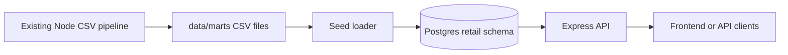

# Data Serving Layer

Phase 2 moves the API from placeholders to Postgres-backed reads over the existing retail marts.

## Design

The CSV marts in `data/marts/` remain the source of truth. Postgres is a local serving layer that mirrors those marts with simple one-table-per-mart structures. This keeps the portfolio architecture clear without over-normalizing the analytics outputs too early.



## Tables

The schema lives in `infra/postgres/schema/001_init.sql`.

| Table | Source CSV |
| --- | --- |
| `retail.mart_monthly_revenue` | `data/marts/mart_monthly_revenue.csv` |
| `retail.mart_category_performance` | `data/marts/mart_category_performance.csv` |
| `retail.mart_regional_margin` | `data/marts/mart_regional_margin.csv` |
| `retail.mart_channel_performance` | `data/marts/mart_channel_performance.csv` |
| `retail.mart_cohort_retention` | `data/marts/mart_cohort_retention.csv` |
| `retail.mart_forecast_accuracy` | `data/marts/mart_forecast_accuracy.csv` |
| `retail.mart_forecast_backtest` | `data/marts/mart_forecast_backtest.csv` |
| `retail.mart_anomaly_alerts` | `data/marts/mart_anomaly_alerts.csv` |

## Load Data

Start Postgres:

```powershell
docker compose up -d postgres
```

Apply schema and load marts:

```powershell
docker compose --profile seed run --rm seed
```

The seed loader truncates mart-serving tables before loading, so repeated runs avoid duplicate rows. Missing optional CSV files are skipped with a message.

## API Endpoints

Start the API after loading data:

```powershell
docker compose up -d --build api
```

Examples:

```powershell
Invoke-RestMethod http://localhost:3000/api/dashboard/summary
Invoke-RestMethod "http://localhost:3000/api/dashboard/revenue?limit=6"
Invoke-RestMethod "http://localhost:3000/api/dashboard/categories?limit=5"
Invoke-RestMethod "http://localhost:3000/api/dashboard/regions?region=Midwest"
Invoke-RestMethod "http://localhost:3000/api/dashboard/channels?channel=Online"
Invoke-RestMethod "http://localhost:3000/api/dashboard/cohorts?month=2024-01"
Invoke-RestMethod "http://localhost:3000/api/dashboard/forecast?limit=6"
Invoke-RestMethod "http://localhost:3000/api/dashboard/anomalies?limit=10"
```

Equivalent curl examples:

```bash
curl http://localhost:3000/api/dashboard/summary
curl "http://localhost:3000/api/dashboard/revenue?limit=6"
curl "http://localhost:3000/api/dashboard/categories?limit=5"
curl "http://localhost:3000/api/dashboard/forecast?limit=6"
```
