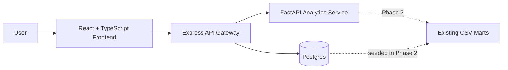

# Full-Stack Architecture Roadmap

The Retail Intelligence Platform extends the existing CSV-backed retail analytics project into a cloud-ready full-stack application.

## Phase 1 Scope

Phase 1 adds only the application scaffold:

- React + TypeScript + Material UI frontend shell
- Express API gateway shell
- FastAPI analytics service shell
- Postgres local database scaffold
- Docker Compose for local service orchestration

The existing data generation, mart build, Python analysis, and static dashboard remain unchanged.

## Phase 2 Direction

Phase 2 loads existing marts from `data/marts/` into Postgres and replaces placeholder dashboard endpoints with real read APIs. The API gateway is responsible for query parameter handling, database access, and response shaping. Auth boundaries and richer analytics-service ownership remain future phases.

For implementation details, see [Data serving layer](data-serving-layer.md).

## Local Services

| Service | Port | Purpose |
| --- | ---: | --- |
| Frontend | 5173 | React application shell |
| API | 3000 | Express gateway |
| Analytics | 8000 | FastAPI analytics service |
| Postgres | 5432 | Local serving database |

## Architecture

