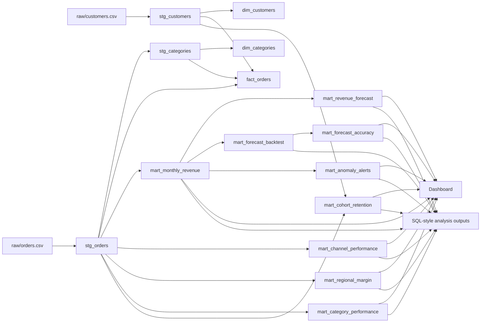

# Lineage

The project follows a small warehouse-style lineage pattern.



## Pipeline Order

1. Generate source CSVs.
2. Build staging models.
3. Build dimensions, facts, and marts.
4. Run validation checks.
5. Materialize SQL-style analysis outputs.
6. Write dashboard summary and executive summary.
7. Optionally run the Python analysis layer.

The build runner is:

```powershell
node scripts/build.js
```
