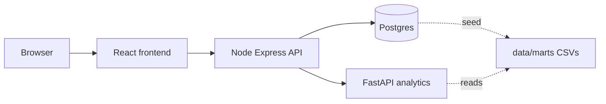
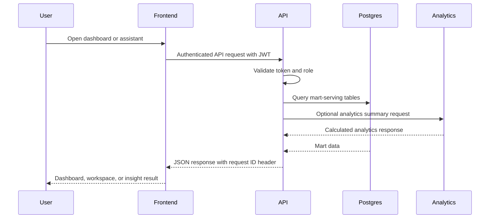
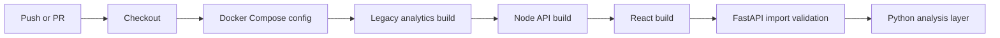
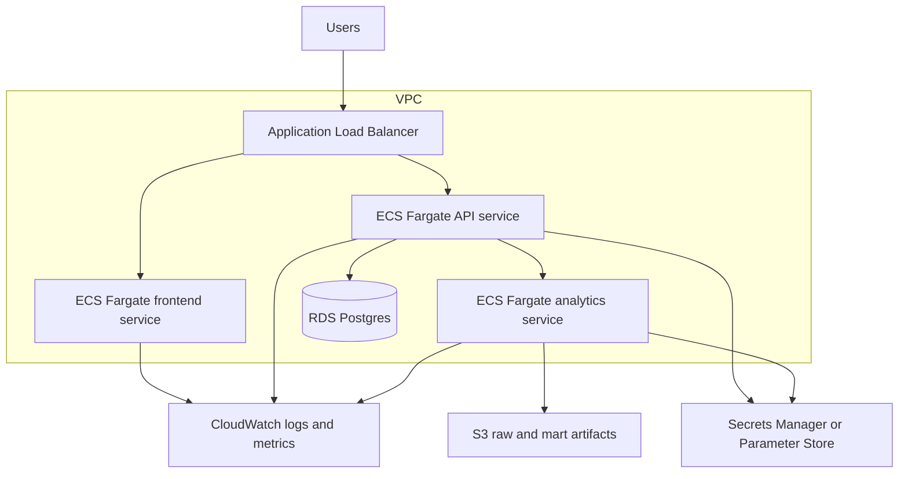

# Observability, CI/CD, and Cloud Architecture

Phase 8 adds production-minded validation and architecture documentation without deploying cloud infrastructure. The local stack remains Docker Compose based, and AWS deployment is a target architecture plan.

## Local Docker Architecture

Health checks are defined for frontend, API, analytics, and Postgres. Service startup is intentionally not fully health-gated so local development does not wait forever when one dependency is being rebuilt. The seed job waits for Postgres health before loading marts.

## Observability

Node API:

- Structured JSON request logs with method, path, status code, duration, and request ID.
- `x-request-id` is accepted from callers or generated per request.
- Structured error logs include request ID.
- Public `/health` remains lightweight for container probes.
- Public `/status` and `/api/status` report Postgres and analytics service dependency health.

FastAPI analytics service:

- Structured JSON request logs with request ID, method, path, status code, and duration.
- Public `/health` remains lightweight for container probes.
- Public `/status` reports mart directory availability.
- Unhandled exceptions return a consistent JSON error response with request ID.

Frontend:

- The React app keeps user-facing loading and error states in the dashboard, workspace, and insights assistant.
- Future production monitoring could add Sentry, OpenTelemetry browser traces, or a managed RUM product.

## Request Flow

## CI/CD Validation

The GitHub Actions workflow validates build and import safety only. It does not deploy infrastructure.

## AWS Target Architecture

Recommended AWS services:

- ECS/Fargate for frontend, API, and analytics containers.
- RDS Postgres for mart-serving tables.
- S3 for raw CSVs, mart artifacts, exports, and backup handoffs.
- CloudWatch for logs, metrics, alarms, and container insights.
- Secrets Manager or SSM Parameter Store for JWT secrets, database credentials, and future LLM credentials.
- Application Load Balancer for TLS termination and routing.
- Private subnets for API, analytics, and database; public subnets only for the ALB.
- Security groups scoped by service-to-service access.
- IAM task roles with least-privilege access to S3, logs, and secrets.

## Scalability And Availability

- Scale frontend and API ECS services horizontally behind the ALB.
- Scale analytics service independently because analytics calls can be more CPU intensive.
- Use RDS Multi-AZ for higher availability once the project moves beyond local demo data.
- Keep mart loads idempotent and schedule them through EventBridge or a small ECS task in a future phase.

## Cost Optimization

- Start with small Fargate tasks and a small RDS instance.
- Use scheduled scale-down for demo environments.
- Store historical raw/mart files in S3 lifecycle tiers.
- Add CloudWatch log retention policies instead of keeping logs forever.

## Disaster Recovery

- Enable automated RDS backups and point-in-time restore.
- Version S3 buckets that hold raw and mart artifacts.
- Document a restore path: restore RDS, redeploy ECS services, reload marts if needed.

## Security And Compliance Notes

- Replace local demo users with Cognito, Auth0, Okta, or another identity provider.
- Use HTTPS at the ALB and secure cookies or a hardened token strategy.
- Keep secrets outside container images and source control.
- Add WAF and rate limits for public endpoints in production.
- Export audit/security logs to CloudWatch or a SIEM as requirements mature.

## Future Terraform Plan

Terraform should be added later as infrastructure code, not as a partial Phase 8 implementation. A future module layout could include:

- `network`: VPC, subnets, route tables, NAT, security groups.
- `database`: RDS Postgres, subnet group, backups.
- `ecs`: cluster, task definitions, services, IAM task roles.
- `load_balancer`: ALB, listeners, target groups, TLS certificate wiring.
- `observability`: CloudWatch log groups, alarms, dashboards.
- `storage`: S3 buckets and lifecycle policies.
